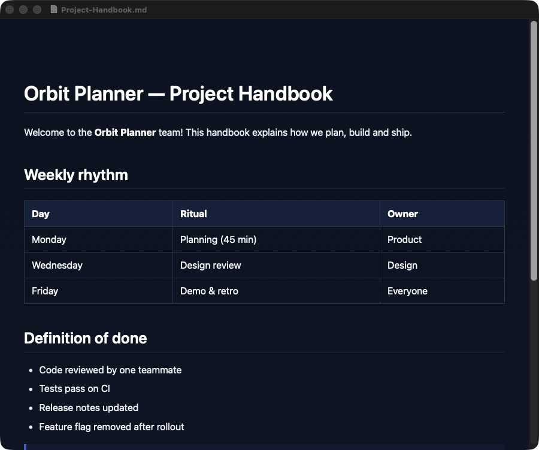

# Markdown Viewer (macOS)

A tiny native macOS app (AppKit + WebKit, no dependencies) to read Markdown files. It renders `.md` / `.markdown` files in a clean dark reading view and can be set as the default app for Markdown files, so a double-click in Finder opens a nicely formatted page instead of a text editor.

## Screenshot

*Rendering a made-up sample document.*



## Features

- Built-in Markdown renderer (headings, emphasis, lists, tables, block quotes, code blocks, links)
- Opens several files at once, one window per file; `⌘O` to open, `⌘W` to close
- Text zoom with `⌘+` / `⌘-` / `⌘0`
- Links open in Google Chrome when installed, otherwise in the default browser
- Draggable window from the top bar

## Build and install

Requires the Xcode Command Line Tools (`swiftc`).

```bash
./build.sh
```

The script compiles the app, installs `Markdown Viewer.app` in `/Applications`, registers it with Launch Services and — if [`duti`](https://github.com/moretension/duti) is installed (`brew install duti`) — makes it the default viewer for `.md` and `.markdown` files.

## Project structure

```
Sources/MarkdownViewer/main.swift              app delegate, windows, menus
Sources/MarkdownViewer/MarkdownRenderer.swift  Markdown → HTML
Resources/Info.plist                           bundle metadata and document types
build.sh                                       build + install script
```
